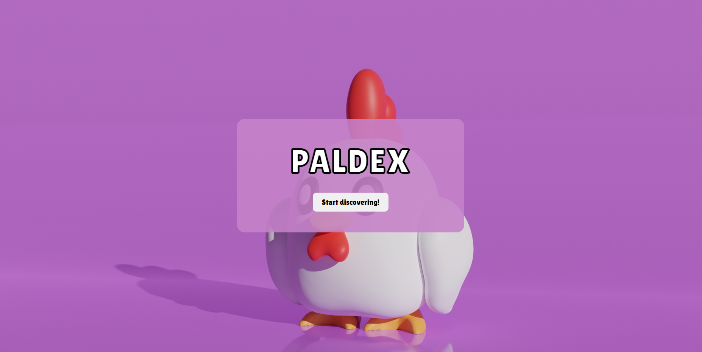

# Paldex Interface

Welcome to the Paldex Interface, a project that stands as a testament to the agility and potential of modern web development tools. This MVP (Minimum Viable Product) was crafted in the span of a single afternoon, embodying the essence of rapid development with the goal of exploring the capabilities of Vite as an alternative to `create-react-app`.

## Project Overview

Given its development as an MVP within a limited timeframe, the Paldex Interface is very much a work-in-progress. While it showcases the core functionalities and integrates with the [Palworld Paldex API](https://github.com/mlg404/palworld-paldex-api) for dynamic content, it openly invites further development, optimization, and personalization.

## Getting Involved

Considering the experimental and MVP nature of the Paldex Interface, contributions are highly encouraged. Whether you're drawn to refining its code, enhancing its functionality, or correcting any oversights, your input is valuable. Fork the project, embrace its potential, and help steer its evolution.

## Acknowledgments

- A nod of appreciation to the [Palworld Paldex API](https://github.com/mlg404/palworld-paldex-api) for the API data, enriching this project with dynamic content and serving as a pivotal component of this experiment.

## License

This project is open-sourced under the MIT License. See the [LICENSE](LICENSE) file for more details.
